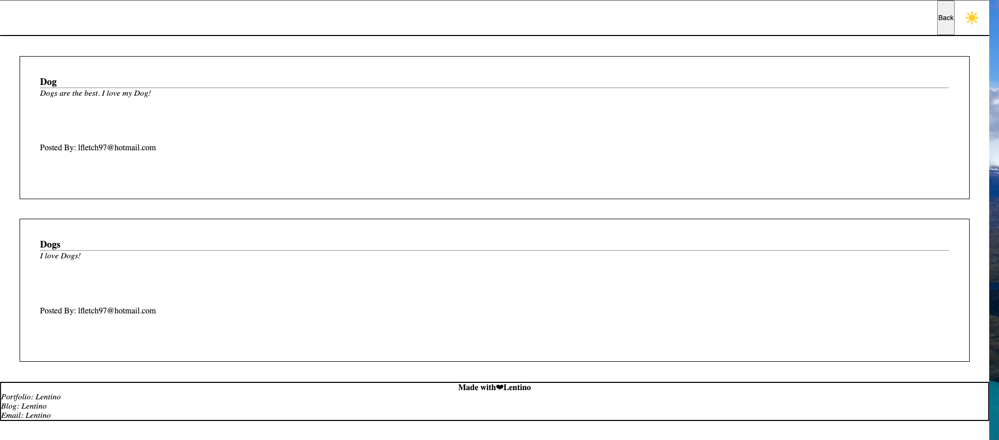
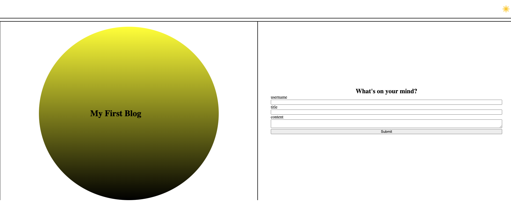

# Challenge-4-Personal-Blog

## Description

The student will create a two-page website for users to input and view blog posts! On successful submission, the input data is stored in local storage and the user is redirected to the viewing page.

Page 1: Blog Post Submission
Purpose: This page allows users to create and submit new blog posts.

Layout:

Header: What's on your mind?

Submission Form:
Username: An input field for entering your username
Title: Title your blog post!
Content: Add some context to your title!

Page 2: Blog Post Viewer
Purpose: This page displays all submitted blog posts, allowing users to read and explore them.

## Usage

## License

